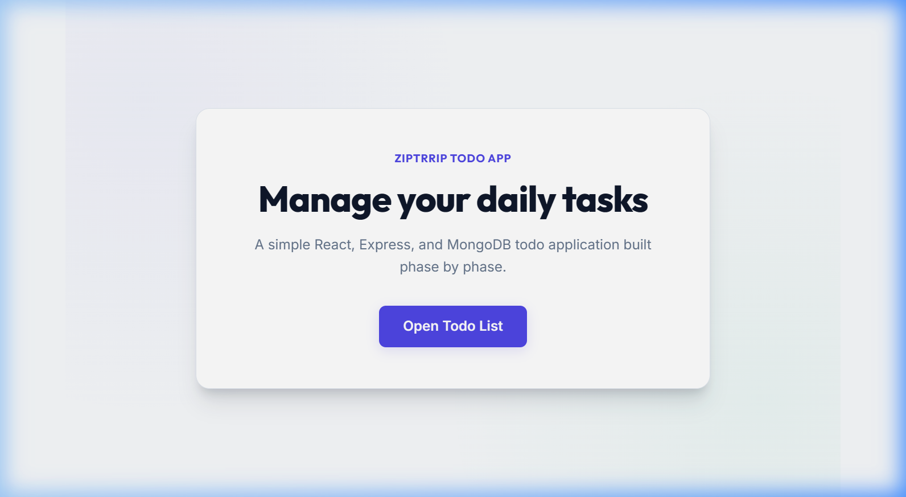
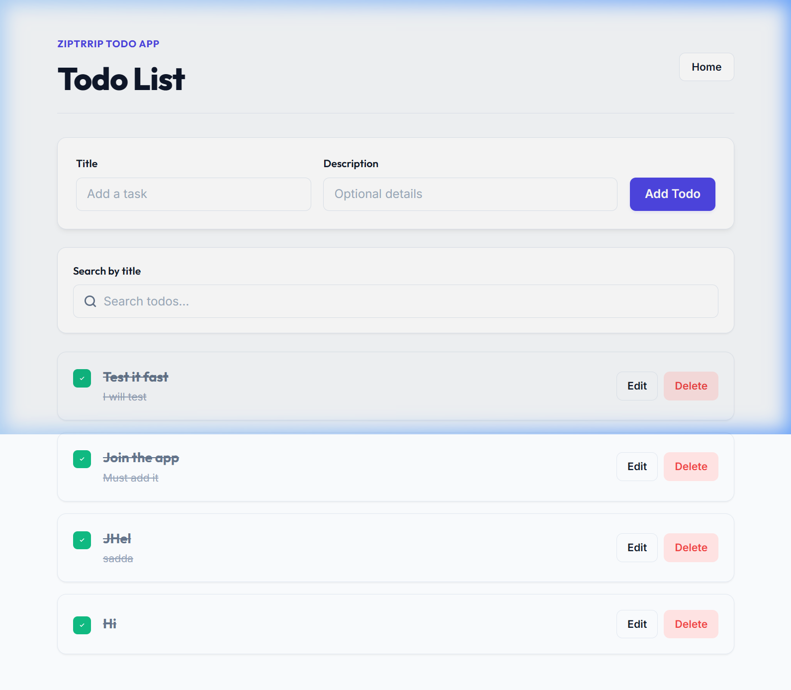
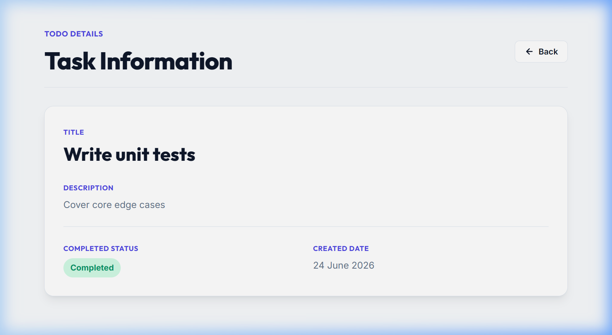

# Ziptrrip Todo Application

A modern, responsive, and visual full-stack Todo Management Application built using the MERN stack (MongoDB, Express, React, Node.js) with Vite.

## Screenshots

### Home Page


### Todo List Page


### Task Details Page


---

## Tech Stack

### Frontend
- **Framework**: React 19 (Functional components and Hooks)
- **Tooling**: Vite (Fast development server and bundling)
- **Styling**: Vanilla CSS (Custom design system variables, shimmers, and responsive grids)
- **Fonts**: Google Fonts (`Outfit` for headings, `Inter` for body copy)

### Backend
- **Runtime**: Node.js
- **Framework**: Express 5
- **Database**: MongoDB (via Mongoose ORM)
- **Cross-Origin Requests**: CORS middleware

---

## Folder Structure

```text
Ziptriptask/
├── backend/                  # Express API Server
│   ├── controllers/          # Request handlers and business logic
│   │   └── todoController.js
│   ├── models/               # Mongoose database models
│   │   └── Todo.js
│   ├── routes/               # API endpoint routing
│   │   └── todoRoutes.js
│   ├── .env.example          # Template for backend env variables
│   ├── index.js              # Server entry point and database connection
│   └── package.json
├── frontend/                 # Vite + React Frontend
│   ├── public/               # Public assets
│   ├── src/                  # React source files
│   │   ├── pages/            # View components (Page views)
│   │   │   ├── TodoDetails.jsx
│   │   │   └── Todos.jsx
│   │   ├── App.css           # Global custom stylesheet & design tokens
│   │   ├── App.jsx           # Routing dispatcher and App wrapper
│   │   ├── index.css         # Typography overrides and body setups
│   │   └── main.jsx          # Entry mount point
│   ├── .env.example          # Template for frontend env variables
│   ├── index.html            # HTML layout
│   └── package.json
├── FEATURES.md               # Detailed features checklist
└── README.md                 # Project configuration and instructions
```

---

## Environment Variables

### Backend (`/backend/.env`)
Create a file named `.env` in the `/backend` folder with the following variables:
```env
PORT=5000
MONGO_URI=mongodb+srv://<username>:<password>@cluster0.mongodb.net/<dbname>
```

### Frontend (`/frontend/.env`)
Create a file named `.env` in the `/frontend` folder with the following variables:
```env
VITE_API_URL=http://localhost:5000
```

---

## Installation

### Prerequisites
- Node.js (version 18+ recommended)
- npm (Node Package Manager)
- A running MongoDB instance (local or MongoDB Atlas cluster)

### Steps

1. **Clone or navigate to the workspace directory**:
   ```bash
   cd Ziptriptask
   ```

2. **Install Backend Dependencies**:
   ```bash
   cd backend
   npm install
   ```

3. **Install Frontend Dependencies**:
   ```bash
   cd ../frontend
   npm install
   ```

---

## Run Instructions

You need to run both the backend server and the frontend client simultaneously.

### Running Backend (from `/backend`)
To start the backend in development watch mode:
```bash
npm run dev
```
Or to run in production mode:
```bash
npm start
```
The server will start listening on `http://localhost:5000` (or your configured `PORT`).

### Running Frontend (from `/frontend`)
To start the frontend developer server (Vite):
```bash
npm run dev
```
The client will start running and display the link (usually `http://localhost:5173`).

To build the client application for production deployment:
```bash
npm run build
```
This builds static assets to `/frontend/dist`.

---

## API Endpoints

All backend routes are prefixed with `/api/todos`.

| Method | Endpoint | Description | Request Body | Response Status |
| :--- | :--- | :--- | :--- | :--- |
| **GET** | `/api/todos` | Retrieves all todos, sorted by `createdAt` descending. | *None* | `200 OK` (Array of objects) |
| **GET** | `/api/todos/:id` | Retrieves a single todo by its ID. | *None* | `200 OK` / `404 Not Found` |
| **POST** | `/api/todos` | Creates a new todo. | `{ title, description }` | `201 Created` / `400 Bad Request` |
| **PUT** | `/api/todos/:id` | Updates an existing todo (text, description, or status). | `{ title, description, completed }` | `200 OK` / `404 Not Found` |
| **DELETE** | `/api/todos/:id` | Deletes a todo by its ID. | *None* | `200 OK` / `404 Not Found` |
